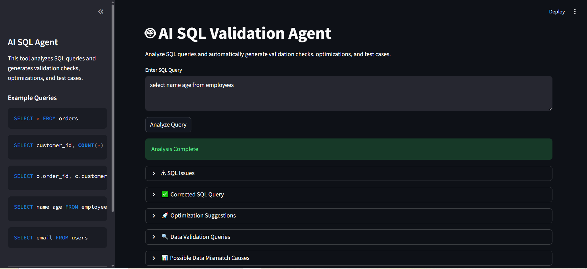

# AI SQL Validation Agent

AI SQL Validation Agent is an AI-powered tool that analyzes SQL queries and automatically generates validation checks, query corrections, optimization suggestions, and testing scenarios.

The application is designed to assist developers, data engineers, and testers in reviewing SQL queries and identifying potential issues before execution. It provides automated insights that help ensure query correctness, improve performance, and support data validation workflows.

The application interface is built using Streamlit and integrates a local language model served through Ollama.

---

## Overview

SQL queries used in analytics, ETL pipelines, and data validation processes often require manual review to detect syntax errors, logical issues, and performance problems. This project provides an automated assistant that analyzes SQL queries and generates structured feedback to help improve query quality.

The tool uses an AI model to interpret the query and produce detailed outputs including detected issues, corrected SQL, optimization recommendations, and testing suggestions.

---

## Key Features

- Detection of SQL syntax and logical issues
- Automatic generation of corrected SQL queries
- Query optimization recommendations
- Generation of data validation queries
- Identification of potential data mismatch causes
- Automatic generation of SQL test cases
- Query history tracking for previously analyzed queries
- Example SQL queries available in the sidebar for quick testing

---

## Technology Stack

Python  
Streamlit  
Ollama  
Phi3 Language Model  
SQLParse

---

## Project Structure

AI_SQL_AGENT/

app.py  
Streamlit web interface for interacting with the SQL validation agent.

ai_agent.py  
Handles AI-based SQL analysis and response generation.

main.py  
Core backend logic used by the application.

requirements.txt  
Contains the project dependencies.

README.md  
Project documentation.

app_screenshot.png  
Application interface screenshot.

---

## Installation and Setup

Clone the repository

git clone https://github.com/10rishika06/AI-SQL-Validation-Agent.git

Navigate to the project directory

cd AI-SQL-Validation-Agent

Install required dependencies

pip install -r requirements.txt

Start the Ollama service

ollama serve

Download the Phi3 model

ollama pull phi3

Run the Streamlit application

streamlit run app.py

Open the application in your browser

http://localhost:8501

---

## Example SQL Queries

Example 1

SELECT * FROM orders

Example 2

SELECT customer_id, COUNT(*)  
FROM orders  
GROUP BY customer_id

Example 3

SELECT o.order_id, c.customer_name  
FROM orders o  
JOIN customers c  
ON o.customer_id = c.customer_id

Example 4 (Query with syntax issue)

select name age from employees

Example 5

SELECT email FROM users

---

## Application Output

When a query is analyzed, the system generates structured results including:

SQL Issues  
Corrected SQL Query  
Optimization Suggestions  
Data Validation Queries  
Possible Data Mismatch Causes  
Suggested Test Cases  

The application also maintains a query history of recently analyzed SQL statements.

---

## Application Screenshot

The following image shows the SQL validation results generated by the AI SQL Validation Agent.

